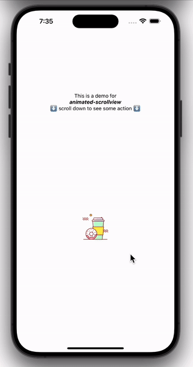

# animated-scrollview-example-usage 🛝

This is a simple example app made from the expo typescript template. It includes a basic usage of the [animated-scrollview](https://www.npmjs.com/package/animated-scrollview) library.

## How to use?

Just install the project via npm or yarn and run the corresponding script from `package.json` to start up the app. The start screen includes the demo.

## Live Demo

Instead of cloning this repository etc. you can also check out this [Live Demo (Expo Snack)](https://snack.expo.dev/@maks-io/animated-scrollview-demo).
